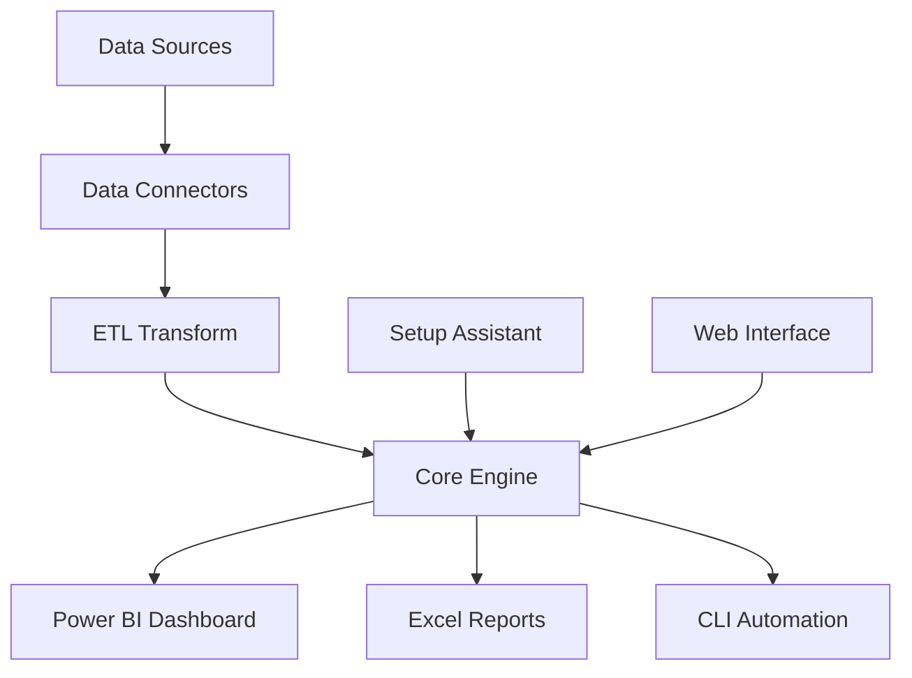

#  Monthly Inventory Manager (MIM)

[](LICENSE)
[](https://www.python.org/downloads/)
[](#)

> **Comprehensive inventory management solution with Power BI dashboards, Excel automation, and intelligent analytics.**

##  Features

###  **Inventory Dashboard (Power BI)**
- Executive-level KPI reporting with MCCNO branding
- Multi KPI visuals with GMROI, revenue, sell-through rates
- Interactive analytics with drill-down capabilities  
- Automated data refresh and scheduling

###  **Excel Integration** 
- Automated workbook generation from templates
- Dynamic formatting and conditional styling
- Multi-sheet reports with charts and pivot tables
- Export to PDF and other formats

###  **Data Connectors**
- CSV/Excel file imports with validation
- Database connectivity (SQLite, SQL Server)
- API integrations for real-time data
- Automated data cleansing and transformation

###  **CLI Automation**
- Batch processing for large datasets
- Scheduled report generation  
- Command-line tools for power users
- Integration with task schedulers

###  **ETL & Transform**
- Data quality validation and cleansing
- Business rule enforcement
- Calculated fields and aggregations
- Historical data tracking and versioning

##  Quick Start (5 minutes)

### Prerequisites
-  **Git** - https://git-scm.com/
-  **Python 3.8+** - https://python.org/
-  **Power BI Desktop** (Windows) - https://powerbi.microsoft.com/desktop/

### Setup
```bash
# 1. Clone repository
git clone https://github.com/TexSupport504/monthly-inventory-manager.git
cd monthly-inventory-manager

# 2. Run setup assistant (handles everything!)
python tools/setup-assistant/setup.py
# or Windows PowerShell:
.\tools\setup-assistant\setup.ps1

# 3. Generate your first report
python generate_workbook.py

# 4. Launch operations controller  
python ops_controller.py
```

** That's it! You now have a complete inventory management system.**

### What You Get Out of the Box
```
monthly-inventory-manager/
  features/inventory-dashboard/    # Power BI dashboard with MCCNO theme
  data/                          # Your inventory data
  reports/                       # Generated Excel/PDF reports  
  tools/setup-assistant/         # Friendly setup automation
  ops_controller.py              # Main operations interface
  docs/guides/                   # Comprehensive documentation
```

##  Documentation

| Guide | Description |
|-------|-------------|
|  [**Quick Start**](docs/guides/quickstart.md) | Get running in 5 minutes |
|  [**Setup Guide**](docs/guides/setup.md) | Detailed installation & configuration |
|  [**Troubleshooting**](docs/guides/troubleshooting.md) | Common issues & solutions |
|  [**Power BI Guide**](features/inventory-dashboard/Power_BI_Setup_Guide.md) | Dashboard setup & customization |

##  Architecture



### Core Components

####  **Operations Controller** (`ops_controller.py`)
Central hub for all MIM operations with interactive menu system.

####  **Power BI Dashboard** (`features/inventory-dashboard/`)
Executive reporting with:
- MCCNO branded theme (#003366 navy, #FFB500 golden)
- Multi KPI visuals (GMROI, Revenue, Sell-Through, Days Supply)  
- Interactive charts and drill-through functionality
- Automated data refresh capabilities

####  **Excel Generator** (`generate_workbook.py`)
Automated report creation:
- Template-based workbook generation
- Dynamic charts and pivot tables
- Conditional formatting and styling
- Multi-format export (XLSX, PDF)

####  **Setup Assistant** (`tools/setup-assistant/`)
Friendly setup automation:
- Cross-platform compatibility (Windows/macOS/Linux)
- Prerequisite checking and validation
- Configuration file generation
- Sample data creation and testing

##  Who Is This For?

###  **Inventory Managers**
- Monthly reporting automation
- KPI tracking and trend analysis
- Exception reporting for critical stock levels
- Executive summaries and presentations

###  **Business Analysts**  
- Data transformation and cleansing
- Advanced analytics and forecasting
- Custom report generation
- Dashboard creation and maintenance

###  **IT Professionals**
- Automated data pipeline management
- Integration with existing systems
- Scheduled batch processing
- System monitoring and maintenance

###  **Executives**
- High-level KPI dashboards
- Performance trend analysis
- Strategic decision support
- Board presentation materials

##  Development

### Project Structure
```
monthly-inventory-manager/
 features/                   # Feature modules
    inventory-dashboard/    # Power BI dashboard  
    data-connectors/        # Import/export utilities
    etl-transform/          # Data processing
    report-pack/            # Report generators
    cli-automation/         # Command-line tools
 tools/                      # Development utilities
 data/                       # Data storage
 reports/                    # Generated outputs
 docs/                       # Documentation
 tests/                      # Unit tests
 samples/                    # Sample data & examples
```

### Contributing

We welcome contributions! Please see:
-  [**CONTRIBUTING.md**](CONTRIBUTING.md) - Contribution guidelines
-  [**CODE_OF_CONDUCT.md**](CODE_OF_CONDUCT.md) - Community standards  
-  [**SECURITY.md**](SECURITY.md) - Security policy

### Development Setup
```bash
# Clone with development tools
git clone https://github.com/TexSupport504/monthly-inventory-manager.git
cd monthly-inventory-manager

# Install development dependencies
pip install -r requirements-dev.txt

# Run tests
python -m pytest tests/

# Pre-commit hooks  
pre-commit install
```

##  Configuration

### Environment Configuration (`.env`)
```ini
# Database
DATABASE_TYPE=sqlite
DATABASE_PATH=./data/inventory.db

# Power BI Integration  
POWERBI_WORKSPACE=your-workspace
POWERBI_DATASET_ID=your-dataset-id

# Features
ENABLE_WEB_INTERFACE=true
ENABLE_AUTO_REFRESH=false
LOG_LEVEL=INFO
```

### Application Configuration (`config.yaml`)
```yaml
app:
  name: "Monthly Inventory Manager"
  version: "0.1.0"
  
features:
  inventory_dashboard: true
  data_connectors: true
  etl_transform: true
  report_pack: true
  cli_automation: true
```

##  Support

### Getting Help
1.  **Documentation** - Check our comprehensive guides
2.  **Search Issues** - Look for similar problems
3.  **Discussions** - Community Q&A
4.  **Report Bug** - Open a detailed issue

### Issue Templates
-  [Bug Report](.github/ISSUE_TEMPLATE/bug_report.md)
-  [Feature Request](.github/ISSUE_TEMPLATE/feature_request.md)
-  [Question](.github/ISSUE_TEMPLATE/question.md)

##  License

This project is licensed under the MIT License - see [LICENSE](LICENSE) file for details.

##  Roadmap

### Version 0.2.0 (Q4 2025)
- [ ] Web-based dashboard interface
- [ ] Advanced forecasting algorithms  
- [ ] Multi-tenant support
- [ ] API endpoints for integration

### Version 0.3.0 (Q1 2026)
- [ ] Mobile responsive interface
- [ ] Real-time notifications
- [ ] Advanced security features
- [ ] Cloud deployment options

##  Acknowledgments

- **Power BI Community** - Dashboard inspiration and techniques
- **Python Data Science Community** - Libraries and tools
- **MCCNO** - Branding and business requirements
- **Contributors** - Thank you for making this better!

---

<div align="center">

** Star this repo if MIM helps your inventory management!**

[** Documentation**](docs/)  [** Quick Start**](docs/guides/quickstart.md)  [** Issues**](https://github.com/TexSupport504/monthly-inventory-manager/issues)  [** Discussions**](https://github.com/TexSupport504/monthly-inventory-manager/discussions)

</div>
